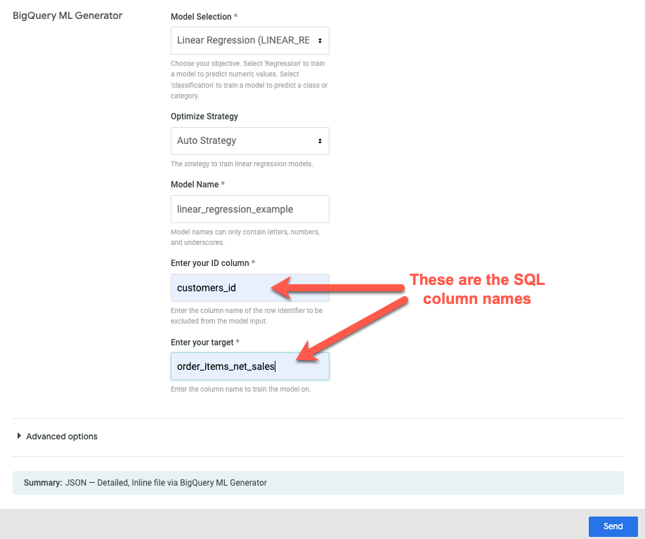
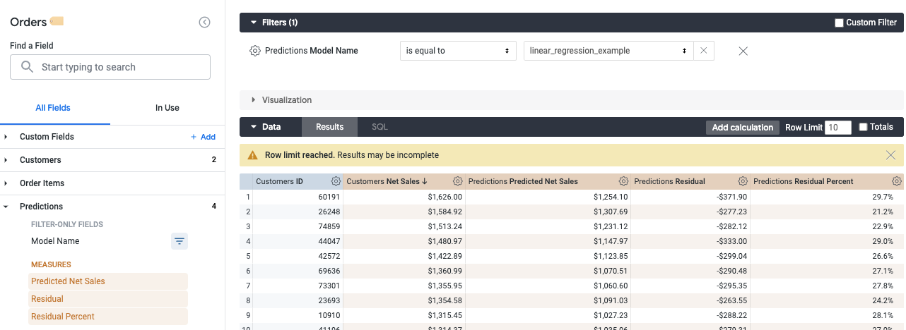
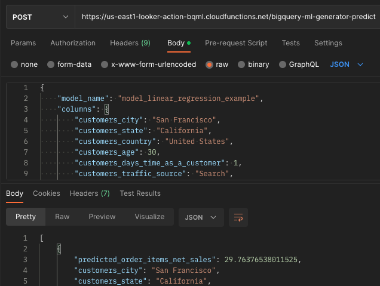

This guide will walk you through integrating Looker with BigQuery ML via Cloud Functions using the Looker Action API. Users can use the Looker Explore to examine data, then send the Looker query to a Cloud Function, specifying any BigQuery ML parameters on the form submissions.

There are four Cloud Functions included in this demo. Three of the functions are used to communicate with Looker via the [Action API](https://github.com/looker-open-source/actions/blob/master/docs/action_api.md):

1. `action_list` - Lists the metadata for the action, including the form and execute endpoints
1. `action_form` - The dynamic form template to presented to users to send parameters to the execute endpoint. This can be easily customised to add more functionality to the [`CREATE MODEL`](https://cloud.google.com/bigquery-ml/docs/reference/standard-sql/bigqueryml-syntax-create) statement
1. `action_execute` - The function to create a BigQuery ML model and corresponding BigQuery view to be used for predictions from Looker. This function will parse the SQL query that Looker generates, remove the row limit, and wrap it in a `CREATE MODEL` statement with the specified parameters

An additional function `predict` can be used to return predictions dynamically by submitting a model name and input data

## Installation:

Use [Cloud Shell](https://cloud.google.com/shell) or the [`gcloud CLI`](https://cloud.google.com/sdk/docs/install) for the following steps.

The only variable you need to modify is the `PROJECT` ID you want to deploy the Cloud Functions to. Update the `REGION` and `DATASET` if you wish to change this from the default values.

1. Specify REGION, PROJECT, and DATASET variables below

   ```
   ACTION_LABEL="BigQuery ML Generator"
   ACTION_NAME="bigquery-ml-generator"
   REGION="us-east1"
   PROJECT="my-project-id"
   DATASET="bqml"
   ```

1. Clone this repo

   ```
   git clone https://github.com/looker-open-source/bqml-actions.git
   cd bqml-actions/
   ```

1. Create a [.env.yaml](.env.yaml.example) with required variables:

   ```
   printf "ACTION_LABEL=${ACTION_LABEL}\nACTION_NAME=${ACTION_NAME}\nREGION=${REGION}\nPROJECT=${PROJECT}\nDATASET=${DATASET}" > .env.yaml
   ```

1. Generate the LOOKER_AUTH_TOKEN secret. The auth token secret can be any randomly generated string. You can generate such a string with the openssl command:

   ```
   LOOKER_AUTH_TOKEN="`openssl rand -hex 64`"
   ```

1. Create the secret and grant access to the Cloud Function service account (by [default](https://cloud.google.com/functions/docs/securing/function-identity#runtime_service_account) the "App Engine default service account"):

   ```
   printf ${LOOKER_AUTH_TOKEN} | gcloud secrets create LOOKER_AUTH_TOKEN --data-file=- --replication-policy=user-managed --locations=${REGION} --project=${PROJECT}
   gcloud secrets add-iam-policy-binding LOOKER_AUTH_TOKEN --member=serviceAccount:${PROJECT}@appspot.gserviceaccount.com --role="roles/secretmanager.secretAccessor --project=${PROJECT}"
   ```

1. Create a dataset and `bqml_models` table for generated models and models table to store metadata on generated BigQuery models and corresponding views:

   ```
   bq --location=US mk --dataset ${PROJECT}:${DATASET}
   bq mk --table ${DATASET}.bqml_models bqml_models.json
   ```

1. Deploy 4 cloud functions for action hub listing, action form, action execute, and predictions (this may take a few minutes):

   ```
   gcloud functions deploy bigquery-ml-generator-list --entry-point action_list --env-vars-file .env.yaml --trigger-http --runtime=python38 --allow-unauthenticated --timeout=540s --region=${REGION} --project=${PROJECT} --set-secrets 'LOOKER_AUTH_TOKEN=LOOKER_AUTH_TOKEN:latest'
   gcloud functions deploy bigquery-ml-generator-form --entry-point action_form --env-vars-file .env.yaml --trigger-http --runtime=python38 --allow-unauthenticated --timeout=540s --region=${REGION} --project=${PROJECT} --set-secrets 'LOOKER_AUTH_TOKEN=LOOKER_AUTH_TOKEN:latest'
   gcloud functions deploy bigquery-ml-generator-execute --entry-point action_execute --env-vars-file .env.yaml --trigger-http --runtime=python38 --allow-unauthenticated --timeout=540s --region=${REGION} --project=${PROJECT} --set-secrets 'LOOKER_AUTH_TOKEN=LOOKER_AUTH_TOKEN:latest'
   gcloud functions deploy bigquery-ml-generator-predict --entry-point predict --env-vars-file .env.yaml --trigger-http --runtime=python38 --allow-unauthenticated --timeout=540s --region=${REGION} --project=${PROJECT} --set-secrets 'LOOKER_AUTH_TOKEN=LOOKER_AUTH_TOKEN:latest'
   ```

1. Copy the Action Hub URL (`action_list` endpoint) and the `LOOKER_AUTH_TOKEN` to input into Looker:

   ```
   echo Action Hub URL: https://${REGION}-${PROJECT}.cloudfunctions.net/${ACTION_NAME}-list
   echo LOOKER_AUTH_TOKEN: $LOOKER_AUTH_TOKEN
   ```

1. In Looker, go to the **Admin > Actions** page and click **Add Action Hub**

   - Enter the Action Hub URL
   - click **Configure Authorization** and enter the `LOOKER_AUTH_TOKEN` value for the Authorization Token and click **Enable**
   - Toggle the **Enabled** button and click **Save**

## Creating BigQuery ML Models:

1. Copy the boilerplate LookML code in the [LookML](./LookML/) folder to a new project and update the `connection` name in the [retail model file](./LookML/models/retail.model.lkml)

   - <details><summary> Explore the data and choose columns to send, e.g.: </summary>

     `https://${YOUR_LOOKER_DOMAIN}.com/explore/retail/order_items?fields=customers.id,customers.city,customers.state,customers.country,customers.age,customers.days_time_as_a_customer,customers.traffic_source,customers.gender,order_items.last_order_date,order_items.average_basket_value,order_items.average_basket_size,order_items.return_count,order_items.has_returns,order_items.total_returns,order_items.number_of_orders,inventory_items.list_of_product_category,order_items.gross_sales,order_items.net_sales&f[predictions.model_name]=&sorts=order_items.average_basket_value+desc&limit=20`

     </details>

   - Send to the BigQuery ML Generator destination:
     

## Predictions:

Predictions can be made in an Explore query or via the `predict` Cloud Function. It may take a few minutes to up to a few hours for the model to build.

1. In Looker - select your new model name from `predictions.model_name` and run a query, e.g. new customers that have registered in the past day:
   

- Using the `predict` Cloud Function directly - you can dynamically send data to run predictions on the fly, e.g.:
  
- Make sure to include the auth token in the following format: `Authorization: Token token="${LOOKER_AUTH_TOKEN}"`

## Troubleshooting:

If the model build fails, you will receive an email notification. Go to the **Admin > Scheduler History** page to view the error message returned from the Action or use `scheduled_plan` System Activity Explore:

- <details><summary> Explore query to see details on action executions: </summary>

  `https://${YOUR_LOOKER_DOMAIN}.com/explore/system__activity/scheduled_plan?fields=scheduled_job.id,scheduled_job.created_time,scheduled_plan_destination.action_type,scheduled_plan_destination.format,scheduled_job.status,scheduled_plan.run_once,scheduled_plan_destination.parameters,scheduled_job.status_detail&f[scheduled_plan_destination.action_type]=bigquery-ml-generator&sorts=scheduled_job.created_time+desc&limit=500&vis=%7B%7D&filter_config=%7B%22scheduled_plan_destination.action_type%22%3A%5B%7B%22type%22%3A%22%3D%22%2C%22values%22%3A%5B%7B%22constant%22%3A%22bigquery-ml-generator%22%7D%2C%7B%7D%5D%2C%22id%22%3A1%2C%22error%22%3Afalse%7D%5D%7D&dynamic_fields=%5B%7B%22measure%22%3A%22sum_of_runtime_in_seconds%22%2C%22based_on%22%3A%22scheduled_job_stage.runtime%22%2C%22expression%22%3A%22%22%2C%22label%22%3A%22Sum+of+Runtime+in+Seconds%22%2C%22type%22%3A%22sum%22%2C%22_kind_hint%22%3A%22measure%22%2C%22_type_hint%22%3A%22number%22%7D%5D&origin=share-expanded`

  </details>
